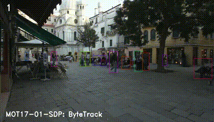

# ByteTrack

[](https://paperswithcode.com/sota/multi-object-tracking-on-mot17?p=bytetrack-multi-object-tracking-by-1)

[](https://paperswithcode.com/sota/multi-object-tracking-on-mot20-1?p=bytetrack-multi-object-tracking-by-1)

#### ByteTrack is a simple, fast and strong multi-object tracker.

<p align="center"></p>


## Abstract
Multi-object tracking (MOT) aims at estimating bounding boxes and identities of objects in videos. Most methods obtain identities by associating detection boxes whose scores are higher than a threshold. The objects with low detection scores, e.g. occluded objects, are simply thrown away, which brings non-negligible true object missing and fragmented trajectories. To solve this problem, we present a simple, effective and generic association method, tracking by associating every detection box instead of only the high score ones. For the low score detection boxes, we utilize their similarities with tracklets to recover true objects and filter out the background detections. When applied to 9 different state-of-the-art trackers, our method achieves consistent improvement on IDF1 scores ranging from 1 to 10 points. To put forwards the state-of-the-art performance of MOT, we design a simple and strong tracker, named ByteTrack. For the first time, we achieve 80.3 MOTA, 77.3 IDF1 and 63.1 HOTA on the test set of MOT17 with 30 FPS running speed on a single V100 GPU.
<p align="center"></p>

## Tracking performance
### Results on MOT challenge test set
| Dataset    |  MOTA | IDF1 | HOTA | MT | ML | FP | FN | IDs | FPS |
|------------|-------|------|------|-------|-------|------|------|------|------|
|MOT17       | 80.3 | 77.3 | 63.1 | 53.2% | 14.5% | 25491 | 83721 | 2196 | 29.6 |
|MOT20       | 77.8 | 75.2 | 61.3 | 69.2% | 9.5%  | 26249 | 87594 | 1223 | 13.7 |

### Visualization results on MOT challenge test set
   
   

## Installation
### 1. Installing on the host machine
Step1. Install ByteTrack.
```shell
git clone https://github.com/ifzhang/ByteTrack.git
cd ByteTrack
pip3 install -r requirements.txt
python3 setup.py develop
```

Step2. Install [pycocotools](https://github.com/cocodataset/cocoapi).

```shell
pip3 install cython; pip3 install 'git+https://github.com/cocodataset/cocoapi.git#subdirectory=PythonAPI'
```

Step3. Others
```shell
pip3 install cython_bbox
```
### 
## Data preparation

Download [MOT17](https://motchallenge.net/), [MOT20](https://motchallenge.net/), [CrowdHuman](https://www.crowdhuman.org/), [Cityperson](https://github.com/Zhongdao/Towards-Realtime-MOT/blob/master/DATASET_ZOO.md), [ETHZ](https://github.com/Zhongdao/Towards-Realtime-MOT/blob/master/DATASET_ZOO.md) and put them under <ByteTrack_HOME>/datasets in the following structure:
```
datasets
   |——————mot
   |        └——————train
   |        └——————test
   └——————crowdhuman
   |         └——————Crowdhuman_train
   |         └——————Crowdhuman_val
   |         └——————annotation_train.odgt
   |         └——————annotation_val.odgt
   └——————MOT20
   |        └——————train
   |        └——————test
   └——————Cityscapes
   |        └——————images
   |        └——————labels_with_ids
   └——————ETHZ
            └——————eth01
            └——————...
            └——————eth07
```


## Training

The COCO pretrained YOLOX model can be downloaded from their [model zoo](https://github.com/Megvii-BaseDetection/YOLOX/tree/0.1.0). After downloading the pretrained models, you can put them under <ByteTrack_HOME>/pretrained.

* **Train ablation model (MOT17 half train and CrowdHuman)**

```shell
cd <ByteTrack_HOME>
python3 tools/train.py -f exps/example/mot/yolox_x_ablation.py -d 8 -b 48 --fp16 -o -c pretrained/yolox_x.pth
```

* **Train MOT17 test model (MOT17 train, CrowdHuman, Cityperson and ETHZ)**

```shell
cd <ByteTrack_HOME>
python3 tools/train.py -f exps/example/mot/yolox_x_mix_det.py -d 8 -b 48 --fp16 -o -c pretrained/yolox_x.pth
```

* **Train MOT20 test model (MOT20 train, CrowdHuman)**

For MOT20, you need to clip the bounding boxes inside the image.

Add clip operation in [line 134-135 in data_augment.py](https://github.com/ifzhang/ByteTrack/blob/72cd6dd24083c337a9177e484b12bb2b5b3069a6/yolox/data/data_augment.py#L134), [line 122-125 in mosaicdetection.py](https://github.com/ifzhang/ByteTrack/blob/72cd6dd24083c337a9177e484b12bb2b5b3069a6/yolox/data/datasets/mosaicdetection.py#L122), [line 217-225 in mosaicdetection.py](https://github.com/ifzhang/ByteTrack/blob/72cd6dd24083c337a9177e484b12bb2b5b3069a6/yolox/data/datasets/mosaicdetection.py#L217), [line 115-118 in boxes.py](https://github.com/ifzhang/ByteTrack/blob/72cd6dd24083c337a9177e484b12bb2b5b3069a6/yolox/utils/boxes.py#L115).

```shell
cd <ByteTrack_HOME>
python3 tools/train.py -f exps/example/mot/yolox_x_mix_mot20_ch.py -d 8 -b 48 --fp16 -o -c pretrained/yolox_x.pth
```

* **Train custom dataset**

First, you need to prepare your dataset in COCO format. You can refer to [MOT-to-COCO](https://github.com/ifzhang/ByteTrack/blob/main/tools/convert_mot17_to_coco.py) or [CrowdHuman-to-COCO](https://github.com/ifzhang/ByteTrack/blob/main/tools/convert_crowdhuman_to_coco.py). Then, you need to create a Exp file for your dataset. You can refer to the [CrowdHuman](https://github.com/ifzhang/ByteTrack/blob/main/exps/example/mot/yolox_x_ch.py) training Exp file. Don't forget to modify get_data_loader() and get_eval_loader in your Exp file. Finally, you can train bytetrack on your dataset by running:

```shell
cd <ByteTrack_HOME>
python3 tools/train.py -f exps/example/mot/your_exp_file.py -d 8 -b 48 --fp16 -o -c pretrained/yolox_x.pth
```


## Tracking

* **Evaluation on MOT17 half val**

Run ByteTrack:

```shell
cd <ByteTrack_HOME>
python3 tools/track.py -f exps/example/mot/yolox_x_ablation.py -c pretrained/bytetrack_ablation.pth.tar -b 1 -d 1 --fp16 --fuse
```
You can get 76.6 MOTA using our pretrained model.

Run other trackers:
```shell
python3 tools/track_sort.py -f exps/example/mot/yolox_x_ablation.py -c pretrained/bytetrack_ablation.pth.tar -b 1 -d 1 --fp16 --fuse
python3 tools/track_deepsort.py -f exps/example/mot/yolox_x_ablation.py -c pretrained/bytetrack_ablation.pth.tar -b 1 -d 1 --fp16 --fuse
python3 tools/track_motdt.py -f exps/example/mot/yolox_x_ablation.py -c pretrained/bytetrack_ablation.pth.tar -b 1 -d 1 --fp16 --fuse
```

* **Test on MOT17**

Run ByteTrack:

```shell
cd <ByteTrack_HOME>
python3 tools/track.py -f exps/example/mot/yolox_x_mix_det.py -c pretrained/bytetrack_x_mot17.pth.tar -b 1 -d 1 --fp16 --fuse
python3 tools/interpolation.py
```
Submit the txt files to [MOTChallenge](https://motchallenge.net/) website and you can get 79+ MOTA (For 80+ MOTA, you need to carefully tune the test image size and high score detection threshold of each sequence).

* **Test on MOT20**

We use the input size 1600 x 896 for MOT20-04, MOT20-07 and 1920 x 736 for MOT20-06, MOT20-08. You can edit it in [yolox_x_mix_mot20_ch.py](https://github.com/ifzhang/ByteTrack/blob/main/exps/example/mot/yolox_x_mix_mot20_ch.py)

Run ByteTrack:

```shell
cd <ByteTrack_HOME>
python3 tools/track.py -f exps/example/mot/yolox_x_mix_mot20_ch.py -c pretrained/bytetrack_x_mot20.pth.tar -b 1 -d 1 --fp16 --fuse --match_thresh 0.7 --mot20
python3 tools/interpolation.py
```
Submit the txt files to [MOTChallenge](https://motchallenge.net/) website and you can get 77+ MOTA (For higher MOTA, you need to carefully tune the test image size and high score detection threshold of each sequence).


## Combining BYTE with other detectors

Suppose you have already got the detection results 'dets' (x1, y1, x2, y2, score) from other detectors, you can simply pass the detection results to BYTETracker (you need to first modify some post-processing code according to the format of your detection results in [byte_tracker.py](https://github.com/ifzhang/ByteTrack/blob/main/yolox/tracker/byte_tracker.py)):

```
from yolox.tracker.byte_tracker import BYTETracker
tracker = BYTETracker(args)
for image in images:
   dets = detector(image)
   online_targets = tracker.update(dets, info_imgs, img_size)
```

You can get the tracking results in each frame from 'online_targets'. You can refer to [mot_evaluators.py](https://github.com/ifzhang/ByteTrack/blob/main/yolox/evaluators/mot_evaluator.py) to pass the detection results to BYTETracker.

## Citation

```
@article{zhang2022bytetrack,
  title={ByteTrack: Multi-Object Tracking by Associating Every Detection Box},
  author={Zhang, Yifu and Sun, Peize and Jiang, Yi and Yu, Dongdong and Weng, Fucheng and Yuan, Zehuan and Luo, Ping and Liu, Wenyu and Wang, Xinggang},
  booktitle={Proceedings of the European Conference on Computer Vision (ECCV)},
  year={2022}
}
```
